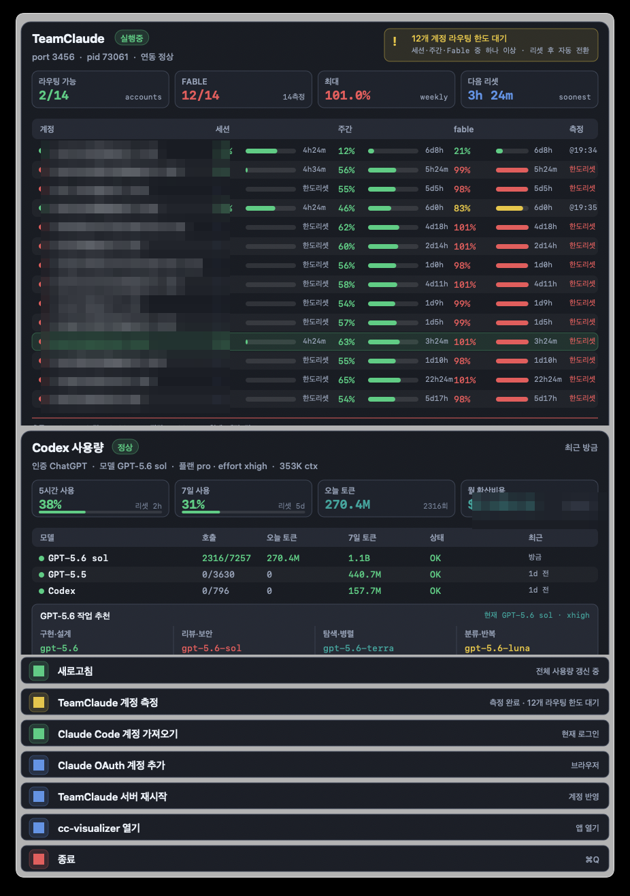

<div align="center">

[English](README.md) | [한국어](README.ko.md) | [简体中文](README.zh-CN.md)

# cc-menubar

**터미널에 ccusage 매번 치지 마세요. 메뉴바에 그냥 떠 있습니다.**


</div>

## 스크린샷

<p align="center">
  <br>
  <sub>메뉴바: 비용, 토큰, 병렬 세션 수, 최다 비용 모델, 라이브 펄스닷, 지출 스파크라인</sub>
</p>

<p align="center">
  <br>
  <sub>드롭다운: teamclaude 14계정 로테이션 현황과 Codex 사용량이 실시간으로</sub>
</p>

## 이게 뭔가요

cc-menubar는 Claude Code(그리고 Codex)를 하루 종일 쓰면서 "이거 대체 얼마 나오는 거지" 싶은 사람을 위한 macOS 메뉴바 앱이에요. 매번 터미널을 열고 ccusage를 치는 대신, 오늘·이번주·이번달·누적 비용이 USD와 원화로 메뉴바에 그냥 떠 있어요.

앱 자체는 800KB짜리 Swift 바이너리 하나예요. 일렉트론도, 백그라운드 런타임도, 앱을 위한 npm install도 없어요.

## 기능

- 💰 **로테이션 비용 요약**: 오늘/이번주/이번달/누적 지출(USD·KRW), 총 토큰, 병렬 세션 수, 최다 비용 모델이 메뉴바에서 돌아가며 나와요
- 💚 **라이브 펄스닷 + 지출 스파크라인**: 세션이 켜져 있으면 초록 점이 숨쉬듯 깜빡이고, 최근 지출 흐름도 함께 보여줘요
- 📈 **14일 지출 차트**: 드롭다운에서 한 순간이 아니라 흐름을 볼 수 있어요
- 🧮 **모델별 비용 분해**: Claude와 Codex/GPT를 나란히 비교해요
- 🩺 **teamclaude 계정 헬스**: 쓸 수 있는 계정 수(N/M), Fable 주간 쿼터 경고, 최대 사용률, 다음 리셋 시각까지
- ⚡ **원클릭 액션**: Claude OAuth 계정 추가, 프록시 재시작

## 요구 사항

- macOS 13 이상
- **Apple Silicon(arm64) 전용이에요.** Intel Mac, Windows, Linux는 지원하지 않아요.
- 빌드하려면 Xcode Command Line Tools(swiftc)가 필요해요
- ccusage 호출에 Node.js/npx를 사용해요

## 설치

```bash
git clone https://github.com/sangrokjung/cc-menubar.git
cd cc-menubar
bash build.sh
bash install.sh
```

install.sh가 LaunchAgent를 등록해요. 로그인할 때 자동으로 켜지고, 크래시가 나도 다시 살아나요.

서명되지 않은 앱이라 처음 실행할 때 macOS Gatekeeper가 막을 수 있어요. install.sh가 quarantine 속성을 대신 지워주지만, 그래도 막히면 둘 중 하나로 풀어주세요.

```bash
xattr -d com.apple.quarantine ~/Applications/cc-menubar/cc-menubar
```

또는 **시스템 설정 → 개인정보 보호 및 보안**에서 **확인 없이 열기**를 눌러주세요.

## 설치 없이 실행하기

한 번만 써보고 싶다면 install.sh는 건너뛰어도 돼요. LaunchAgent도, 로그인 시 자동 시작도 없이 빌드한 바이너리를 바로 실행하면 돼요.

```bash
git clone https://github.com/sangrokjung/cc-menubar.git
cd cc-menubar
bash build.sh
./.build/cc-menubar &
```

## 설정

| 변수 | 기본값 | 설명 |
|---|---|---|
| `TEAMCLAUDE_LAUNCHD_LABEL` | (미설정) | teamclaude를 launchd로 돌린다면 이 값에 label을 지정하세요. 설정하면 Restart 버튼이 `launchctl kickstart`로 깔끔하게 재시작하고, 안 하면 `teamclaude restart` 명령으로 대신 실행해요. |

## 작동 방식

전부 이 Mac 안에서만 돌아가요.

- `~/.claude/projects` 변경을 감시해서 세션이 켜져 있는지 확인해요
- `npx ccusage --json --offline`을 호출해요. `--offline` 옵션이라 네트워크 호출이 없고, 아무것도 바깥으로 나가지 않아요
- teamclaude를 쓴다면 로컬 상태 엔드포인트(`http://localhost:3456/teamclaude/status`)를 선택적으로 조회해요

이메일 주소도, API 토큰도, 개인정보도 어디에도 보이거나 전송되지 않아요.

## 제거

```bash
launchctl unload ~/Library/LaunchAgents/io.github.sangrokjung.cc-menubar.plist
rm ~/Library/LaunchAgents/io.github.sangrokjung.cc-menubar.plist
rm -rf ~/Applications/cc-menubar
```

## 크레딧

- [ccusage](https://github.com/ryoppippi/ccusage) by [ryoppippi](https://github.com/ryoppippi): Claude Code 사용량·비용 데이터를 로컬에서 계산해요
- [teamclaude](https://github.com/jung-wan-kim/teamclaude) by [jung-wan-kim](https://github.com/jung-wan-kim): 여러 Claude 계정을 자동으로 로테이션하는 로컬 프록시예요 (선택 사항)

앱 안의 UI 라벨은 지금은 한국어예요. 다국어 지원 PR은 언제나 환영이에요.

## 라이선스

MIT © 2026 [sangrokjung](https://github.com/sangrokjung)
