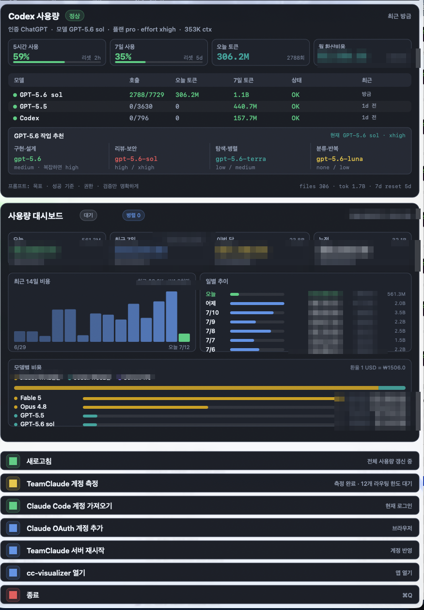

<div align="center">

[English](README.md) | [한국어](README.ko.md) | [简体中文](README.zh-CN.md)

# cc-menubar

**不用每次敲 ccusage，菜单栏里随时看得到。**


</div>

## 截图

<p align="center">
  <br>
  <sub>菜单栏：费用、Token 数、并行会话数、消耗最高的模型、实时脉冲点、支出走势图</sub>
</p>

<p align="center">
  <br>
  <sub>下拉面板：用量仪表盘。14 天费用图表、每日趋势、按模型的开销（Claude 与 Codex 并列）</sub>
</p>

<p align="center">
  <br>
  <sub>下拉面板：teamclaude 14 个账号的轮换状态与 Codex 用量，实时更新</sub>
</p>

## 这是什么

cc-menubar 是一款原生 macOS 菜单栏应用，专为整天用 Claude Code（以及 Codex）、又总想知道"这到底花了多少钱"的人做的。不用打开终端敲 ccusage，今天、本周、本月、累计的花费会直接以 USD 和 KRW 显示在菜单栏里。

应用本体是一个约 800KB 的 Swift 单文件二进制。没有 Electron，没有后台运行时，应用本身也不需要 npm install。

## 功能

- 💰 **轮播费用摘要**：今天/本周/本月/累计费用（USD + KRW）、总 Token 数、并行会话数、消耗最高的模型，在菜单栏里轮流显示
- 💚 **实时脉冲点 + 支出走势图**：有会话在跑的时候，绿色小点会像呼吸一样闪烁，同时显示近期支出走势
- 📈 **14 天支出图表**：在下拉面板里看到的是趋势，而不只是一个瞬间
- 🧮 **按模型拆分费用**：Claude 和 Codex/GPT 并排对比
- 🩺 **teamclaude 账号健康**：可用账号数（N/M）、Fable 每周额度预警、峰值使用率、下次重置时间
- ⚡ **一键操作**：添加 Claude OAuth 账号、重启代理

## 系统要求

- macOS 13 及以上
- **仅支持 Apple Silicon（arm64）**，不支持 Intel Mac、Windows、Linux
- 编译需要 Xcode Command Line Tools（swiftc）
- 调用 ccusage 需要 Node.js / npx

## 安装

```bash
git clone https://github.com/sangrokjung/cc-menubar.git
cd cc-menubar
bash build.sh
bash install.sh
```

install.sh 会注册一个 LaunchAgent：登录时自动启动，崩溃后也会自动重启。

应用没有签名，第一次启动可能会被 macOS Gatekeeper 拦截（install.sh 会自动移除 quarantine 属性）。如果仍被拦截，用下面任一方式解除：

```bash
xattr -d com.apple.quarantine ~/Applications/cc-menubar/cc-menubar
```

或者打开**系统设置 → 隐私与安全性**，点击**仍要打开**。

## 不安装，直接运行

只想试用一次？可以跳过 install.sh，编译后直接运行二进制文件，不注册 LaunchAgent，也不会开机自启。

```bash
git clone https://github.com/sangrokjung/cc-menubar.git
cd cc-menubar
bash build.sh
./.build/cc-menubar &
```

## 配置

| 变量 | 默认值 | 说明 |
|---|---|---|
| `TEAMCLAUDE_LAUNCHD_LABEL` | （未设置） | 如果你用 launchd 运行 teamclaude，把它的 label 填在这里。设置后，Restart 按钮会用 `launchctl kickstart` 干净地重启；不设置的话，会回退到执行 `teamclaude restart` 命令。 |

## 工作原理

一切都只在你的 Mac 上运行：

- 监听 `~/.claude/projects` 的变化来判断会话是否活跃
- 调用 `npx ccusage --json --offline`，`--offline` 意味着没有任何网络请求，数据不会离开你的电脑
- 如果你用 teamclaude，会顺带查询本地状态接口（`http://localhost:3456/teamclaude/status`）

邮箱地址、API Token、个人信息，这些都不会被显示或发送到任何地方。

## 卸载

```bash
launchctl unload ~/Library/LaunchAgents/io.github.sangrokjung.cc-menubar.plist
rm ~/Library/LaunchAgents/io.github.sangrokjung.cc-menubar.plist
rm -rf ~/Applications/cc-menubar
```

## 鸣谢

- [ccusage](https://github.com/ryoppippi/ccusage) by [ryoppippi](https://github.com/ryoppippi)：在本地计算 Claude Code 的用量和费用
- [teamclaude](https://github.com/jung-wan-kim/teamclaude) by [jung-wan-kim](https://github.com/jung-wan-kim)：本地的多账号轮换代理（可选）

应用内的 UI 文案目前是韩文，欢迎提交本地化 PR。

## 许可证

MIT © 2026 [sangrokjung](https://github.com/sangrokjung)
